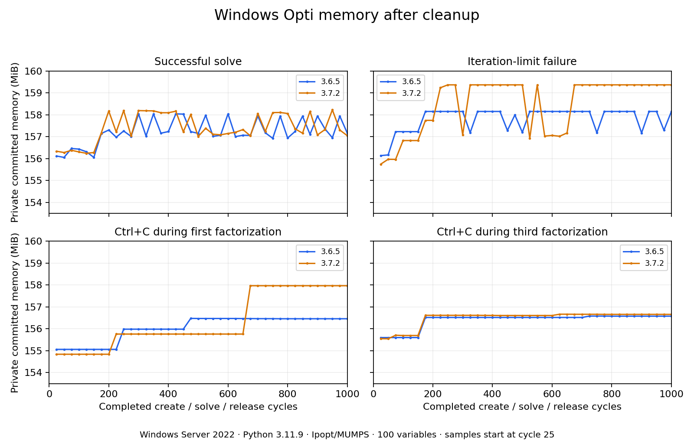

# Windows results, 2026-09-08

[Successful full run](https://github.com/casadi/debug/actions/runs/34269606062)
at commit `71e1e7aa7416667938bf0487fa60e65017837bad`.

Both CasADi 3.6.5 and 3.7.2 completed 1,000 cycles in each of four cases:
8,000 create/solve/release cycles total, including 4,000 real Windows console
Ctrl+C events issued at verified native MUMPS LDLT breakpoints. Each native
run recorded exactly 1,000 injections without sender errors and 1,000
`NonIpopt_Exception_Thrown` statuses. Successful solves and iteration-limit
failures also returned their expected statuses every time.

Environment: Windows Server 2022 Datacenter, build 10.0.20348, Python 3.11.9,
approximately 16 GiB RAM. The workload and cleanup procedure are documented
in the parent README. These are the published wheels, not a source rebuild.

| CasADi | Case | Private MiB at cycle 500 | Private MiB at cycle 1,000 |
|---|---|---:|---:|
| 3.6.5 | Successful solve | 157.152 | 157.164 |
| 3.6.5 | Iteration-limit failure | 157.199 | 158.152 |
| 3.6.5 | First-factorization Ctrl+C | 156.473 | 156.461 |
| 3.6.5 | Third-factorization Ctrl+C | 156.520 | 156.578 |
| 3.7.2 | Successful solve | 157.012 | 157.047 |
| 3.7.2 | Iteration-limit failure | 159.367 | 159.367 |
| 3.7.2 | First-factorization Ctrl+C | 155.762 | 157.969 |
| 3.7.2 | Third-factorization Ctrl+C | 156.609 | 156.660 |

No sustained unbounded growth was reproduced. There are bounded oscillations
and occasional upward steps. In the 3.7.2 first-factorization case, private
memory rose about 2.2 MiB between samples 650 and 675, coinciding with an
increase from four to six threads, then remained exactly flat through cycle
1,000. The measurements establish the coincidence, not the allocation's cause.

Allocated pagefile size stayed at 2,944 MiB on both runners. Current and peak
pagefile usage were both zero before and after the experiment. System commit
did not show accumulated growth after workers exited. This run did not create
memory pressure or reproduce pagefile expansion, so it cannot answer whether
a larger problem on the reporter's 6 GiB machine behaves differently.

`measurements.csv` contains all post-cleanup samples, including pre-solve
baselines. The graph starts at cycle 25. Full JSONL metadata, native stacks,
solver warnings, injection counts, and system snapshots are in the run's
`issue3605-windows-3.6.5` and `issue3605-windows-3.7.2` artifacts.

The follow-up commit `22062fa` separates the pilot step and shortens its timeout;
it does not change the measured workload or signal mechanism. Both updated
pilots passed in [this run](https://github.com/casadi/debug/actions/runs/34270225395).
Its redundant long loops were cancelled after the first full run succeeded.
